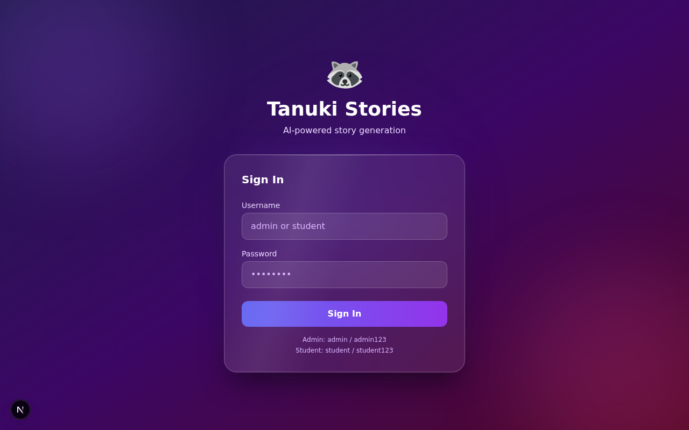
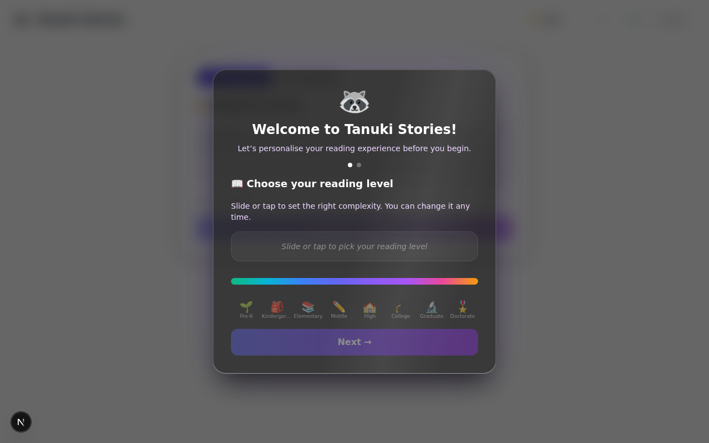
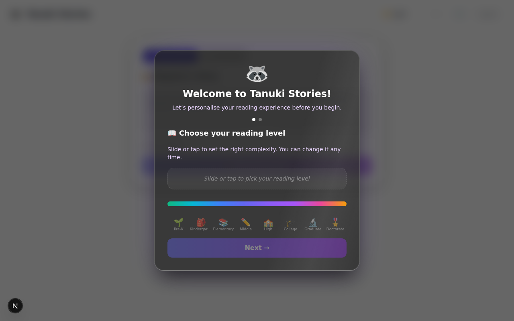
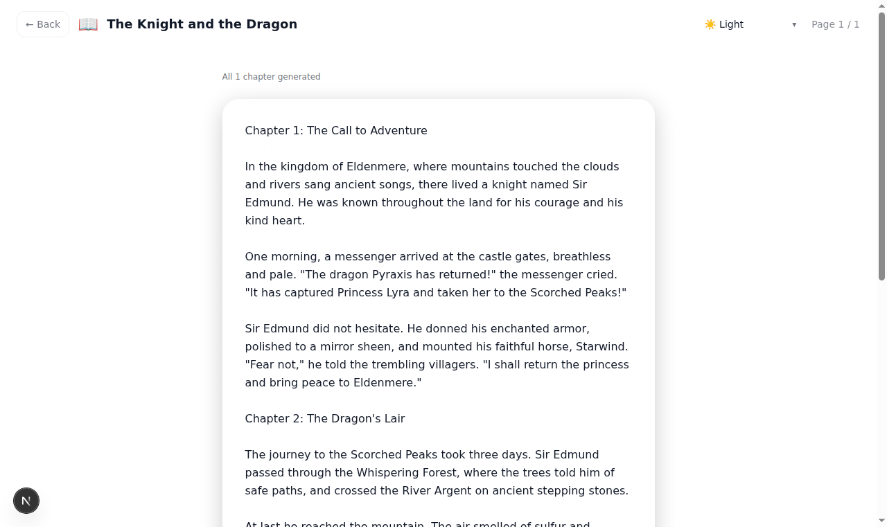
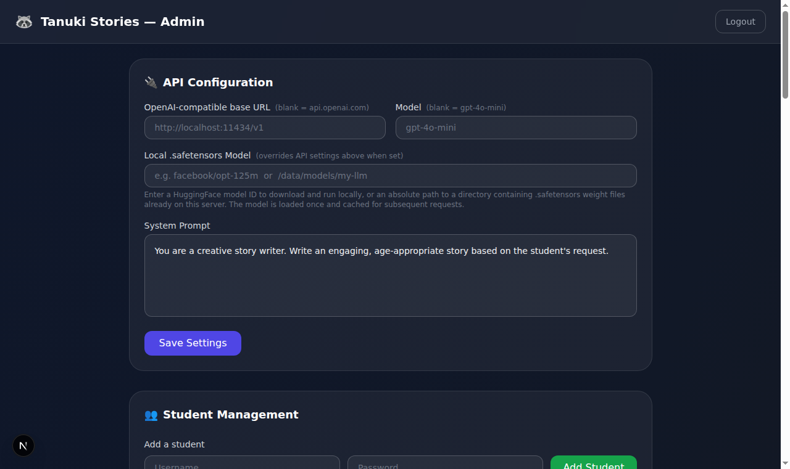
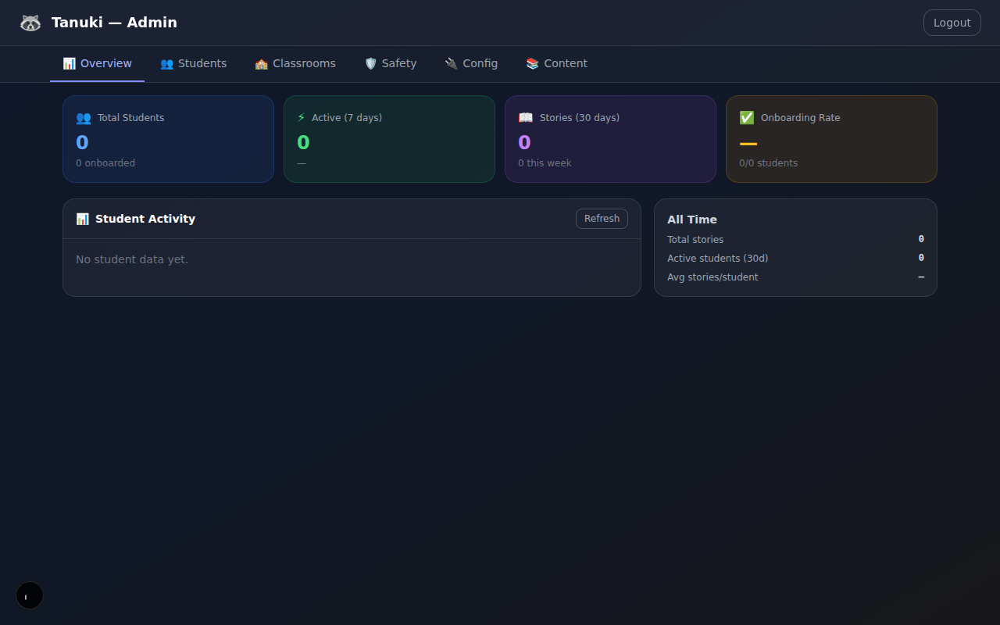

# Tanuki Stories

An AI-powered story generation web app for students.

## Screenshots

<table>
  <tr>
    <td align="center"><strong>Login</strong><br/></td>
    <td align="center"><strong>Story Generation</strong><br/></td>
  </tr>
  <tr>
    <td align="center"><strong>Story Dashboard</strong><br/></td>
    <td align="center"><strong>Story Reader</strong><br/></td>
  </tr>
  <tr>
    <td align="center"><strong>Admin — Settings &amp; Students</strong><br/></td>
    <td align="center"><strong>Admin — Analytics</strong><br/></td>
  </tr>
</table>

## Quick Install (Interactive)

The interactive installers handle Node.js dependencies, AI backend setup (vLLM, llama.cpp, or external API), and `.env.local` generation in one step.

**Linux / macOS:**
```bash
bash install.sh
```

**Windows:**
```bat
install.bat
```

The installer will ask you to choose from:

| Option | Description |
|---|---|
| **Local — vLLM** | NVIDIA GPU required; installs `vllm`, picks a model, generates `start-vllm.sh/.bat` |
| **Local — llama.cpp** | CPU or GPU; installs `llama-cpp-python[server]`, downloads a GGUF model, generates `start-llamacpp.sh/.bat` |
| **External API** | OpenAI, Ollama, LM Studio, Together AI, Groq, or any custom OpenAI-compatible endpoint |
| **Mock / no AI** | Demo mode – no API key needed |

After running a local backend installer, start the AI server first, then start the app:

```bash
# Terminal 1 — AI server
bash start-vllm.sh        # or: bash start-llamacpp.sh

# Terminal 2 — Tanuki Stories
npm run dev
```

Then open the **Admin UI → Settings** and set the *API Base URL* and *Model* to match your local server.

---

## Updating an Existing Install

To update Tanuki Stories without reinstalling, run the update script from the directory where you originally installed it. It will pull the latest code (if you cloned via git), refresh Node.js dependencies, and optionally rebuild for production. Your `.env.local` and all student data in `data/` are left untouched.

**Linux / macOS:**
```bash
bash update.sh
```

**Windows:**
```bat
update.bat
```

---

## Manual Setup

1. Install dependencies:
   ```bash
   npm install
   ```

2. Copy the example env file and fill in your settings:
   ```bash
   cp .env.local.example .env.local
   ```
   Edit `.env.local`:
   - Set `OPENAI_API_KEY` to your API key (optional — the app runs in mock mode without one).
   - Set `SESSION_SECRET` to a long random string.
   - Optionally override `ADMIN_USERNAME` / `ADMIN_PASSWORD` (defaults: `admin` / `admin123`).
   - Optionally set `OPENAI_BASE_URL` for a custom OpenAI-compatible endpoint (can also be changed later in the Admin UI).

3. Run the development server:
   ```bash
   npm run dev
   ```

4. Open [http://localhost:3000](http://localhost:3000).

---

## Demo Accounts

| Role    | Username  | Password     |
|---------|-----------|--------------|
| Admin   | `admin`   | `admin123`   |
| Student | `student` | `student123` |

> Default credentials can be overridden with the `ADMIN_USERNAME` / `ADMIN_PASSWORD` environment variables. Student and teacher accounts are managed through the Admin UI. Student accounts can also be bulk-imported via CSV.

---

## Features

### Student Experience
- **Onboarding**: First-login wizard lets students pick their reading level (Pre-K → Doctorate) and preferred genres/theme; the range of available reading levels can be restricted by an admin.
- **Story generation**: Students describe what they want, then optionally tune:
  - Title, genre (20+ options including Fantasy, Adventure, Mystery, Sci-Fi, Romance, Horror, Comedy, Historical, Thriller, Fairy Tale, Mythology, Sports, Dystopian, Steampunk, and more — or a fully custom genre)
  - Chapter count, reading complexity (Simple / Intermediate / Advanced), vocabulary complexity (Basic / Intermediate / Advanced)
  - A free-form plot outline
  - Content maturity level (within admin-set limits)
- **Co-writer mode**: When enabled (set in onboarding preferences), the AI generates a five-beat story plan (exposition → resolution) that the student can read and edit before generation proceeds chapter by chapter.
- **Info Mode**: Toggle to nonfiction mode — the AI draws on the admin-curated knowledge base to produce factual content.
- **Story history**: All previously generated stories are listed on the dashboard and can be re-read at any time.
- **Story extension**: Students can add more chapters to any completed story directly from the reader.
- **Audio recording**: Students can record themselves reading each page of a story; recordings are saved per page and can be replayed.
- **Themes**: Light, Dark, Sepia, Orbs on White, Orbs on Black — chosen during onboarding and changeable at any time via the ⚙️ button.

### Teacher Dashboard
- **Classroom overview**: Teachers see only the classrooms assigned to them by an admin.
- **Student management**: View students in managed classrooms, inspect their reading levels and onboarding status.
- **Per-student settings**: Adjust content maturity level and blocked topics for individual students within managed classrooms.
- **Analytics**: Per-student activity table (reading level, total stories, recent stories, last active date) scoped to managed classrooms.

### Admin Dashboard
- **Settings**: Edit the system prompt sent to the AI, configure the API base URL and model name.
- **Local model support**: Set a HuggingFace model ID (e.g. `facebook/opt-125m`) or an absolute path to a local `.safetensors` model directory to run inference entirely on-device via `@huggingface/transformers` — no external API needed.
- **Story browser**: View all stories generated by all students.
- **Student management**: Create individual student accounts (username + password) or bulk-import them from a CSV file (`username,password[,reading_level]`). Delete accounts as needed.
- **Teacher management**: Create teacher accounts and assign them to specific classrooms.
- **Classrooms**: Create named groups of students and set per-classroom content maturity defaults and blocked topics. Teachers manage the classrooms assigned to them.
- **Per-student settings**: Lock specific story options (chapter count, reading complexity, vocabulary complexity, genre) for individual students and set admin-controlled default values for those fields. Set per-student content maturity level and blocked topics.
- **Safety & content moderation**: Six-level content maturity system (1 Very Safe → 6 None) with 10 predefined blockable topics (Politics, Religion, Violence, Romance, Horror, Gambling, Drugs & Alcohol, Death & Grief, War & Conflict, Social Media). Settings cascade: global → classroom → per-student; topic block lists are additive across all levels.
- **Reading level range**: Restrict the reading levels students can choose during onboarding (e.g. limit to Elementary → High School).
- **Knowledge base**: Admin-managed library of documents used by Info Mode. Each document is embedded with `Xenova/all-MiniLM-L6-v2` for semantic (vector) search — no external embedding API required.
- **Analytics**: Per-student activity table showing reading level, onboarding status, total stories, stories in the last 7 / 30 days, and last active date.

### Technical
- **Storage**: File-based JSON in `/data` (gitignored) — no database required. Audio recordings stored as `.webm` files under `data/recordings/`.
- **Auth**: Cookie-based sessions; no external auth library. Admin credentials come from environment variables; student and teacher credentials are stored in `data/users.json`.
- **AI backends**: OpenAI API, any OpenAI-compatible endpoint (Ollama, LM Studio, Together AI, Groq, vLLM, llama.cpp), or on-device HuggingFace transformers model. Falls back to mock mode when no key or model is configured.
- **Story generation pipeline**: Planning stage (`/api/stories/plan`) produces a structured five-beat outline → start stage (`/api/stories/start`) creates the story record → chapter stage (`/api/stories/[id]/chapter`) streams each chapter to the client one at a time. Legacy single-shot generation is still used for Info Mode.
